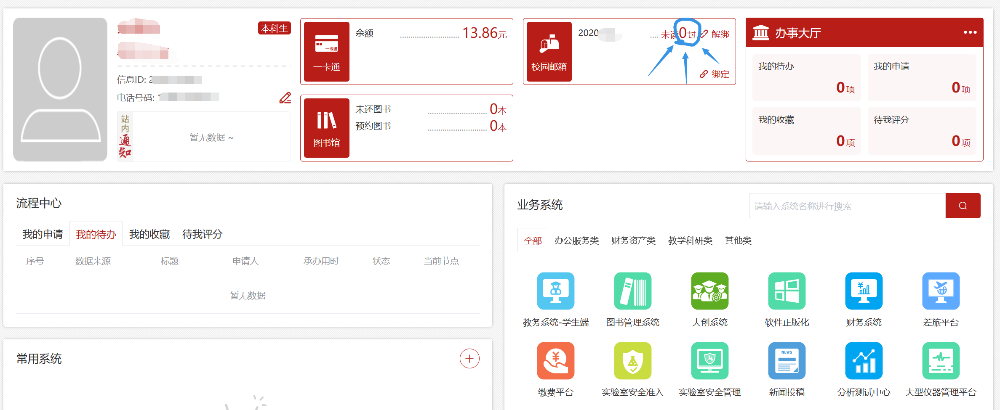
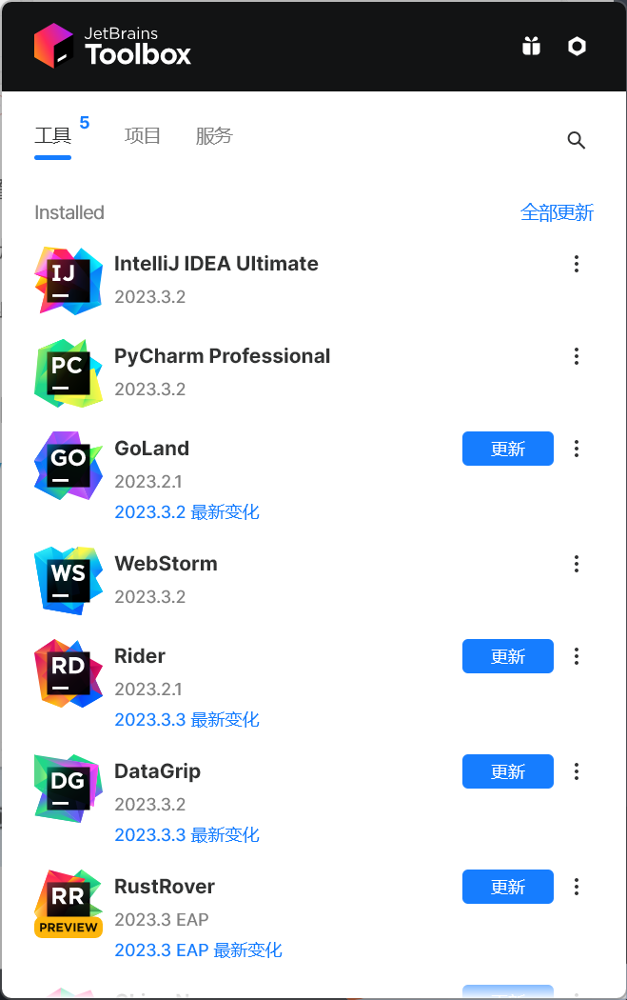

# 琴房管理系统 —— 后端

## 开发前的准备

### 安装 IntelliJ IDEA

#### 准备教育邮箱


点击蓝色圈圈住的地方，进入教育邮箱界面，就能看到你的教育邮箱的地址。

如果你没有注册过教育邮箱，在这个地方应该有“注册教育邮箱”一类的按钮，点击注册后按提示绑定进入。

如果遇到了绑定后进入不了等等问题，直接通过网址访问我校教育邮箱：http://email.mail.hfut.edu.cn/ ，然后输入你的学号和信息门户密码登录。

#### 申请 IntelliJ IDEA 的教育优惠（即教育邮箱白嫖）

进入 JetBrains 的官方教育优惠申请页面：https://www.jetbrains.com/shop/eform/students ，按提示操作即可。

#### 安装 JetBrains Toolbox App

https://www.jetbrains.com/toolbox-app/

#### 安装 IntelliJ IDEA Ultimate

安装 JetBrains Toolbox App 后，点击任务栏右下角托盘的 JetBrains Toolbox App 图标：


在弹出的界面中安装 IntelliJ IDEA Ultimate：


### 安装 Scoop

打开 Windows PowerShell（建议先在 Microsoft Store 中安装 Windows Terminal，再通过 Windows Terminal 打开 Windows Powershell），执行：

> [!IMPORTANT]
> 由于在一般情况下，我们所处地区对于 GitHub 的访问十分的不稳定，所以在执行下面的脚本前，记得将其中 `http://<ip:port>` 改成你的代理设置，如，对于默认情况下的 Clash For Windows 设置而言，应该改为 `http://127.0.0.1:7890` 。实际的具体情况要根据你的系统代理的端口设置决定。
> 如果你可以不需要代理稳定访问 GitHub（比如你本人不在中国大陆地区），那么将下方脚本中的 `-Proxy 'http://<ip:port>'` 部分删除。

```ps1
Set-ExecutionPolicy -ExecutionPolicy RemoteSigned -Scope CurrentUser
Invoke-RestMethod -Uri https://get.scoop.sh -Proxy 'http://<ip:port>' | Invoke-Expression
```

### 安装 git

在 Windows Powershell 中执行：

```ps1
scoop install git
```
